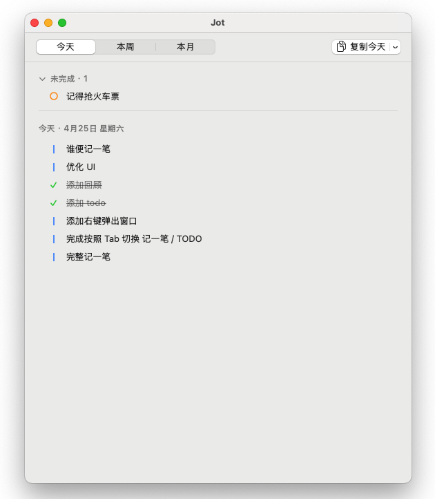

# Jot

桌面角落的极简小生物, 点一下记一笔.

[](LICENSE) []() [](https://github.com/wenyg/jot/releases)




---

## 安装

[Releases](https://github.com/wenyg/jot/releases) 下载 zip, 解压, 拖 `Jot.app` 进 `/Applications`.

首次打开会被 macOS 拦下, 终端跑一行解决:

```bash
xattr -dr com.apple.quarantine /Applications/Jot.app
```

macOS 13.1+, Apple Silicon / Intel 都支持.

## 用法

- **左键小狗** → 写一笔 → 回车.
- **右键小狗** → 开关今日回顾.
- 输入气泡里按 `Tab` 在 *记一笔* 和 *TODO* 之间切.
- 顶部菜单栏的小爪子里能显示/隐藏小狗, 改设置.

数据本地存在 `~/Library/Application Support/Jot/`.

## 自己构建

```bash
brew install xcodegen
git clone https://github.com/wenyg/jot.git && cd jot
./scripts/build.sh
```

## License

[MIT](LICENSE) © 2026 wenyg
